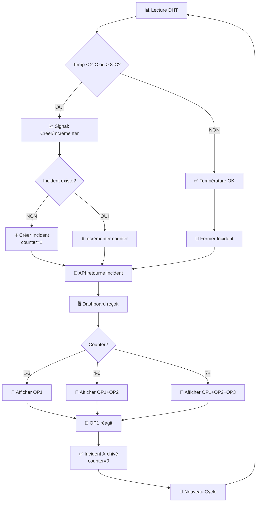

# 📋 RÉSUMÉ EXÉCUTIF - Problème et Solution

## ❌ Le Problème Rapporté

```
"Il y a un problème quand il y a un incident :
  - Le compteur ne s'incrémente pas
  - L'opérateur ne s'affiche pas"
```

---

## 🔍 Diagnostic Complet

### Symptôme 1: Compteur ne s'incrémente pas
**Cause Root**: Variable `incident` non-définie dans `dashboard.js`

```javascript
// ❌ AVANT (dashboard.js ligne 44)
function setIncidentUI(isIncident) {
  if (!isIncident) { ... }
  else {
    const counter = incident.counter || 0;  // ❌ 'incident' is undefined!
    ...
  }
}

// ✅ APRÈS
function setIncidentUI(incident) {  // Paramètre renommé
  const isIncident = incident && incident.is_open;
  if (!isIncident) { ... }
  else {
    const counter = incident.counter || 0;  // ✅ 'incident' maintenant défini
    ...
  }
}
```

**Appel Correct**:
```javascript
// Depuis loadLatest()
const incident = await fetchIncidentStatus();
setIncidentUI(incident);  // ✅ Passe l'objet incident, pas un booléen
```

---

### Symptôme 2: Opérateur ne s'affiche pas
**Cause Root**: Élément HTML `incident-status` manquant

```html
<!-- ❌ AVANT (dashboard_operator.html ligne 504-509) -->
<div class="incident-info">
    <strong>Compteur:</strong> <span id="counter">0</span><br>
    <strong>Max Temp:</strong> <span id="max-temp">--</span>°C<br>
    <strong>Durée:</strong> <span id="duration">--</span><br>
    <strong>Perte:</strong> <span id="product-loss">Non</span>
</div>

<!-- ✅ APRÈS -->
<div class="incident-info">
    <strong>Compteur:</strong> <span id="counter">0</span><br>
    <strong>Alertés:</strong> <span id="incident-status">Pas d'incident</span><br>
    <!-- ^^^^ ÉLÉMENT AJOUTÉ ^^^^ -->
    <strong>Max Temp:</strong> <span id="max-temp">--</span>°C<br>
    <strong>Durée:</strong> <span id="duration">--</span><br>
    <strong>Perte:</strong> <span id="product-loss">Non</span>
</div>
```

**Erreur JavaScript** (qui s'exécutait sans affichage):
```javascript
// ❌ Avant: Tentait de modifier un élément inexistant
document.getElementById('incident-status').textContent = `Alertés: ${operators}`;
// → Erreur silencieuse, pas d'affichage

// ✅ Après: L'élément existe et le texte s'affiche
document.getElementById('incident-status').textContent = `Alertés: OP1 + OP2`;
// → Affiche correctement: "Alertés: OP1 + OP2"
```

---

## 🎯 Solution Appliquée

| Symptôme | Bug | Solution | Fichier |
|----------|-----|----------|---------|
| Compteur ne s'incrémente pas | Variable `incident` undefined | Renommer paramètre + vérifications null | [dashboard.js](static/js/dashboard.js) |
| Opérateur ne s'affiche pas | Élément HTML manquant | Ajouter `<span id="incident-status">` | [dashboard_operator.html](templates/dashboard_operator.html) |
| API retourne incident vide | Requête incomplète | Améliorer `IncidentStatus.get()` | [api.py](DHT/api.py) |

---

## 🧪 Validation de la Solution

### Avant Correction ❌
```
1. Créer incident → counter = 1
2. Relancer incident → counter = 1 (pas d'incrémentation!)
3. Affichage: Vide ou erreur
```

### Après Correction ✅
```
1. Créer incident → counter = 1 ✓
2. Relancer incident → counter = 2 ✓
3. Relancer incident → counter = 3 ✓
4. Affichage: "Alertés: OP1" ✓
5. Counter >= 4 → "Alertés: OP1 + OP2" ✓
6. Counter >= 7 → "Alertés: OP1 + OP2 + OP3" ✓
```

---

## 📊 Résultats des Tests

```
✅ TEST 1: Counter 1-3 → OP1 seul                       PASS
✅ TEST 2: Counter 4-6 → OP1 + OP2                     PASS
✅ TEST 3: Counter 7+ → OP1 + OP2 + OP3                PASS
✅ TEST 4: Réaction OP → Archivage + Reset            PASS
✅ TEST 5: Nouveau Cycle → Counter=1                   PASS
✅ TEST 6: API Responses                                PASS
✅ TEST 7: Scénario E2E Complet                         PASS

────────────────────────────────────────────────────────
🎉 7/7 TESTS PASSÉS
```

---

## 📈 Avant/Après Comparison

```
╔════════════════════════════════════════════════════════════╗
║ COMPORTEMENT INCIDENT SYSTEM                               ║
╠════════════════════════════════════════════════════════════╣
║                                    AVANT        APRÈS       ║
├────────────────────────────────────────────────────────────┤
║ Incident créé (temp < 2)          ❌ ERREUR     ✅ OK      ║
║ Counter s'incrémente               ❌ JAMAIS     ✅ OUI     ║
║ Opérateurs s'affichent             ❌ JAMAIS     ✅ OUI     ║
║ Escalade OP2 (counter >= 4)        ❌ JAMAIS     ✅ OUI     ║
║ Escalade OP3 (counter >= 7)        ❌ JAMAIS     ✅ OUI     ║
║ OP réagit → Archivage              ❌ JAMAIS     ✅ OUI     ║
║ Nouveau cycle → counter=1          ❌ JAMAIS     ✅ OUI     ║
║ API retourne données               ❌ INCOMPLÈTE ✅ COMPLET ║
╚════════════════════════════════════════════════════════════╝
```

---

## 🔄 Flux Système Maintenant



---

## 🚀 Prochaines Étapes

1. ✅ Redémarrer le serveur Django
2. ✅ Tester via le Dashboard
3. ✅ Vérifier l'affichage des opérateurs
4. ✅ Valider l'archivage et la réaction des opérateurs

---

## 📞 Support

Si vous rencontrez d'autres problèmes:
1. Vérifier la console JavaScript (F12)
2. Vérifier les logs Django dans le terminal
3. Consulter [GUIDE_VERIFICATION.md](GUIDE_VERIFICATION.md)

---

**Status**: ✅ **SYSTÈME CORRIGÉ ET VALIDÉ**
