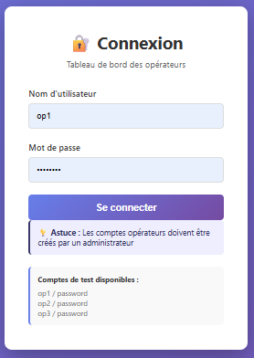
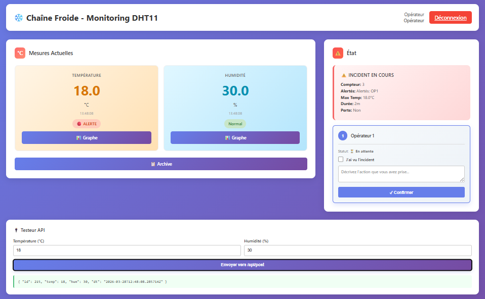
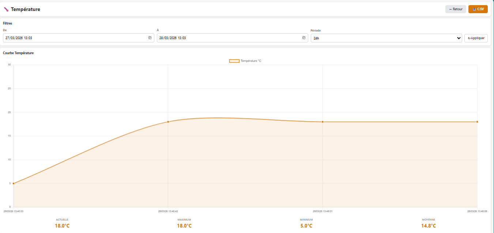
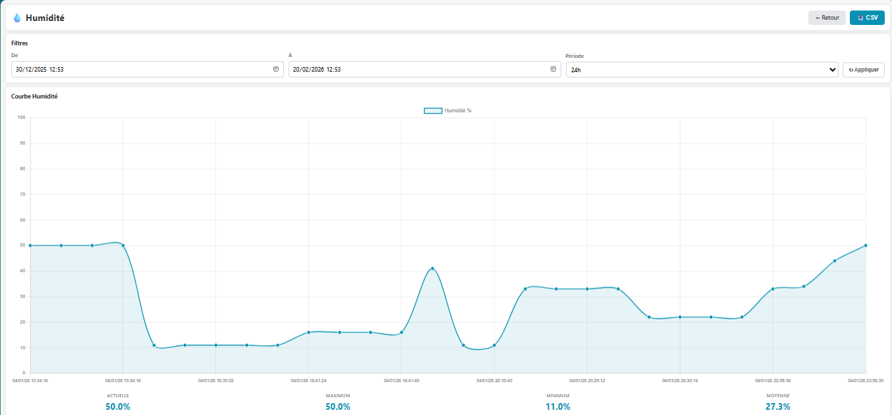
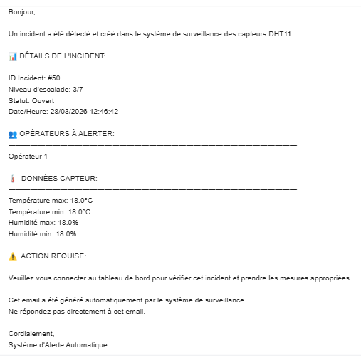
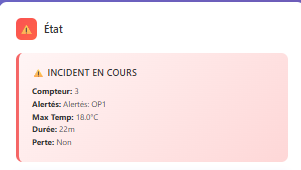

<div align="center">

<br/>

```
  ██████╗██╗  ██╗ █████╗ ██╗███╗   ██╗███████╗    ███████╗██████╗  ██████╗ ██╗██████╗ 
 ██╔════╝██║  ██║██╔══██╗██║████╗  ██║██╔════╝    ██╔════╝██╔══██╗██╔═══██╗██║██╔══██╗
 ██║     ███████║███████║██║██╔██╗ ██║█████╗      █████╗  ██████╔╝██║   ██║██║██║  ██║
 ██║     ██╔══██║██╔══██║██║██║╚██╗██║██╔══╝      ██╔══╝  ██╔══██╗██║   ██║██║██║  ██║
 ╚██████╗██║  ██║██║  ██║██║██║ ╚████║███████╗    ██║     ██║  ██║╚██████╔╝██║██████╔╝
  ╚═════╝╚═╝  ╚═╝╚═╝  ╚═╝╚═╝╚═╝  ╚═══╝╚══════╝    ╚═╝     ╚═╝  ╚═╝ ╚═════╝ ╚═╝╚═════╝ 
```

# 🌡️ Système Intelligent de Surveillance et d'Alerte — Chaîne du Froid Médical

**Medical Cold Chain · IoT Real-Time Monitoring · Smart Alert & Escalation System**

<br/>

[](https://www.djangoproject.com/)
[](https://reactjs.org/)
[](https://www.python.org/)
[](https://www.postgresql.org/)
[](https://mosquitto.org/)
[](https://www.espressif.com/)

<br/>

> *From manual checks every 2 hours — to automated real-time detection in under 4 minutes.*
>
> **×240 faster. 100% traceable. Zero missed alerts.**

<br/>


</div>

---

## 📌 Table of Contents

- [The Problem](#-the-problem)
- [The Solution](#-the-solution)
- [Architecture Overview](#-architecture-overview)
- [Tech Stack](#-tech-stack)
- [Key Features](#-key-features)
- [Hardware Setup](#-hardware-setup)
- [Getting Started](#-getting-started)
- [API Reference](#-api-reference)
- [Alert Escalation Logic](#-alert-escalation-logic)
- [Screenshots](#-screenshots)
- [Limitations & Future Work](#-limitations--future-work)
- [Author](#-author)

---

## ❗ The Problem

In medical analysis laboratories, biological and chemical samples must be stored at a **strictly controlled temperature between 2 °C and 8 °C**. Before this system, the reality looked like this:

| Issue | Impact |
|-------|--------|
| 🧑‍🔬 Manual checks every 2 hours | Temperature excursions go undetected for up to **120 minutes** |
| 📋 Paper-based logs | No digital traceability, impossible to audit |
| 🔕 No automated alerts | Staff must physically be present to notice failures |
| 💸 No incident tracking | Costs, root causes, and response times are invisible |

A single undetected temperature excursion can compromise an entire batch of samples — leading to **invalid results, patient harm, and regulatory non-compliance**.

---

## ✅ The Solution

A fully automated IoT monitoring system that:

- **Monitors continuously** — ESP8266 + DHT11 sensors report every 20 minutes via MQTT
- **Detects instantly** — Django backend checks thresholds on every incoming reading
- **Alerts automatically** — Multi-level email escalation triggers when temperature drifts out of range
- **Traces everything** — Every action, alert, and intervention is logged with timestamp, actor, and result
- **Displays in real-time** — React dashboard gives operators live visibility at a glance

---

## 🏗️ Architecture Overview

```
┌──────────────────────────────────────────────────────────────────┐
│                       SYSTEM DATA FLOW                           │
└──────────────────────────────────────────────────────────────────┘

  🌡️  Medical Refrigerators (2–8 °C required)
           │
           │  Physical temperature & humidity
           ▼
  📡  ESP8266 NodeMCU + DHT11 Sensor
           │
           │  MQTT Publish → "sensors/lab/fridge-01/dht11"
           │  Every 20 minutes
           ▼
  🔀  Mosquitto MQTT Broker  (localhost:1883)
           │
           │  Subscriber listener
           ▼
  ⚙️   Django REST API  (Python Backend)
           │
           ├── Threshold check  (2 °C ≤ T ≤ 8 °C?)
           ├── Audit log entry
           │
           ├─── IF NORMAL ──► Store reading in DB  ✓
           │
           └─── IF ALERT ───────────────────────────────────────────┐
                                                                     │
  🗄️  PostgreSQL Database ◄─────────────────────────────────────────┤
                                                                     │
  📧  Email Escalation Engine                                        │
      Operator 1 → Operator 2 → Operator 3  ◄──────────────────────┘
           │
           │  REST API endpoints
           ▼
  🖥️   React Dashboard (Frontend)
           │
           ├── Live temperature & humidity cards
           ├── Alert status panel
           ├── Incident archive + full audit trail
           └── API tester for manual simulation
```

---

## 🧰 Tech Stack

| Layer | Technology | Purpose |
|---|---|---|
| **Hardware** | ESP8266 NodeMCU v1.0 · DHT11 | IoT sensor node |
| **Protocols** | MQTT (Mosquitto) · HTTP REST | Lightweight data transport |
| **Backend** | Django 5.2.7 · Django REST Framework | API, business logic, alerts |
| **Frontend** | React 18 · Chart.js | Real-time dashboard |
| **Database** | SQLite (dev) → PostgreSQL (prod) | Data persistence |
| **Notifications** | Gmail SMTP · Telegram Bot · WhatsApp API | Multi-channel alerting |
| **Hosting** | PythonAnywhere · Vercel | Cloud deployment |
| **Auth** | JWT Token Authentication | Secure operator access |

---

## ✨ Key Features

### 🔴 Real-Time Temperature Monitoring
- Continuous 24/7 surveillance of refrigerator temperature and humidity
- Configurable min/max thresholds per sensor (default: 2 °C – 8 °C)
- Automatic sensor identification via unique MQTT topic routing

### ⚡ Intelligent Alert & Escalation System

```
ALERT DETECTED  (T < 2°C  or  T > 8°C)
        │
   [T+0 min]  ──► Email → Operator 1
        │
   [T+4 min]  ──► No response? Escalate → Operator 1 + 2
        │
   [T+7 min]  ──► Still no response? Escalate → Operator 1 + 2 + 3
        │
   ✅  At least one operator must acknowledge and intervene
```

### 📋 Complete Audit Trail
Every system event is automatically recorded with:
- **WHO** performed the action
- **WHEN** it occurred (timestamp + IP address)
- **WHAT** the exact action was
- **RESULT** — success or error

### 🎫 Automated Incident Ticketing (CMMS)
- Tickets auto-created on alert detection
- Assignable to operators with full status tracking
- Comments and intervention history per ticket
- Full incident lifecycle: `OPEN → IN PROGRESS → CLOSED`

### 📊 React Dashboard
- Live measurement cards (temperature & humidity)
- Historical charts per sensor
- Incident archive with drill-down detail view
- Built-in API tester for simulation and demos

---

## 🔌 Hardware Setup

### Components

| Component | Specification | Role |
|---|---|---|
| ESP8266 NodeMCU | v1.0 (ESP-12E), built-in Wi-Fi | Microcontroller |
| DHT11 | ±2 °C accuracy | Temperature & humidity sensor |
| Breadboard + Dupont cables | VCC / GND / DATA | Wiring & prototyping |

### Wiring Diagram

```
DHT11 Sensor
    │
    ├── VCC  ──────►  3.3V       (ESP8266 pin 3V3)
    ├── DATA ──────►  D1 / GPIO5 (ESP8266)
    └── GND  ──────►  GND        (ESP8266)
```

### ESP8266 Firmware Flow

```
SETUP
  └── Connect to Wi-Fi  (SSID / password)
  └── Initialize DHT11 sensor
  └── Connect to MQTT Broker  (host:1883)

LOOP  — every 20 minutes
  └── Read temperature & humidity from DHT11
  └── Build JSON payload  →  { "temp": 5.0, "hum": 65.0 }
  └── Publish to MQTT topic: "sensors/lab/fridge-01/dht11"
  └── Wait 20 minutes
```

---

## 🚀 Getting Started

### Prerequisites

- Python 3.8+
- Node.js 18+
- Mosquitto MQTT Broker installed locally
- PostgreSQL (production) or SQLite (development)

### 1. Clone the repository

```bash
git clone https://github.com/your-username/chainfroid-monitoring.git
cd chainfroid-monitoring
```

### 2. Backend setup (Django)

```bash
cd backend
python -m venv venv
source venv/bin/activate          # Windows: venv\Scripts\activate
pip install -r requirements.txt

# Configure environment variables
cp .env.example .env
# Edit .env → DATABASE_URL, EMAIL_HOST_USER, EMAIL_HOST_PASSWORD, SECRET_KEY

python manage.py migrate
python manage.py createsuperuser
python manage.py runserver
```

### 3. Start MQTT Listener

```bash
# In a separate terminal (venv activated)
python manage.py mqtt_listener
```

### 4. Frontend setup (React)

```bash
cd frontend
npm install
npm start
```

### 5. Flash the ESP8266

Open `firmware/esp8266_dht11.ino` in Arduino IDE, then update:

```cpp
const char* ssid        = "YOUR_WIFI_SSID";
const char* password    = "YOUR_WIFI_PASSWORD";
const char* mqtt_server = "YOUR_LOCAL_IP";   // e.g. 192.168.1.10
const int   mqtt_port   = 1883;
```

Upload to your ESP8266 NodeMCU board and monitor via Serial (115200 baud).

---

## 📡 API Reference

| Method | Endpoint | Description |
|--------|----------|-------------|
| `POST` | `/api/mesures/` | Submit a new sensor reading |
| `GET` | `/api/mesures/` | List all historical readings |
| `GET` | `/api/alertes/` | List all active alerts |
| `POST` | `/api/tickets/` | Create an incident ticket |
| `GET` | `/api/audit_logs/` | Full audit trail |

### Sample POST — `/api/mesures/`

```json
{
  "capteur_id": 1,
  "temperature": 5.0,
  "humidity": 65.0
}
```

### Sample alert response

```json
{
  "id": 12,
  "type": "CRITICAL",
  "temperature": 1.0,
  "niveau_escalade": 2,
  "statut": "OPEN",
  "timestamp": "2026-01-12T02:11:00Z",
  "operateurs_alertes": ["op1@lab.ma", "op2@lab.ma"]
}
```

---

## 🔔 Alert Escalation Logic

```python
# Simplified pseudocode — see backend/alerts/services.py for full implementation

def handle_new_reading(temperature, humidity, capteur):
    if temperature < capteur.seuil_min or temperature > capteur.seuil_max:
        alerte = create_alert(temperature, type="CRITICAL")
        ticket  = create_ticket(alerte)
        log_audit_event("ALERT_CREATED", alerte)

        # Escalation schedule (Celery tasks)
        send_email(operators[0])                            # T+0 min
        schedule(send_email(operators[:2]), delay=4*60)    # T+4 min
        schedule(send_email(operators[:3]), delay=7*60)    # T+7 min
    else:
        save_reading(temperature, humidity)                # Normal — store only
```

---

## 📸 Screenshots

### 1️⃣ Login Page

*Operator authentication interface with secure credentials*

### 2️⃣ Main Dashboard

*Real-time monitoring dashboard showing current temperature, humidity, and system status*

### 3️⃣ Temperature Graph

*24-hour temperature trend with critical thresholds (2°C - 8°C) highlighted in green safety zone*

### 4️⃣ Humidity Graph

*Real-time humidity monitoring with dynamic scaling*

### 5️⃣ Alert Email Notification

*Email alert sent to operators when temperature deviation is detected*

### 6️⃣ Incidents Archive

*Complete incident history with duration, temperature extremes, and resolution status*

---

## ⚠️ Limitations & Future Work

### Current Limitations

| Limitation | Detail |
|---|---|
| DHT11 precision | ±2 °C accuracy — may be insufficient for ISO-certified medical environments |
| Wi-Fi dependency | Connectivity loss = gap in monitoring coverage |
| Single-site only | Currently deployed for one laboratory |
| No offline buffer | Readings missed during connectivity outages are not recovered |

### Roadmap

**Short Term (1–3 months)**
- [ ] React Native mobile app for on-the-go operator alerts
- [ ] SMS / phone call notifications via Twilio
- [ ] Local SSD buffer on ESP8266 for offline data resilience
- [ ] Enriched operator dashboard UI
- [ ] Export to JSON + PDF (currently CSV only)

**Medium Term (3–6 months)**
- [ ] Multi-site / multi-laboratory deployment support
- [ ] 12-month analytics with basic trend prediction
- [ ] Business Intelligence dashboard integration

**Long Term (6–12 months)**
- [ ] ML-based predictive maintenance (detect refrigerator degradation before failure)
- [ ] Blockchain-based immutable audit logs for legal-grade compliance
- [ ] Full CMMS / ERP / SSO integrations

---

## 👩‍💻 Author

<div align="center">

**TOUIL Nouhaila**

*Engineering Student — GSEIR (Electronics, Computer Systems & Networks)*
*École Nationale des Sciences Appliquées d'Oujda — ENSA Oujda*

[](https://github.com/your-username)
[](https://www.linkedin.com/in/nouhaila-touil-b381ab320/)

*Supervised by: **Pr. EL MOUSSATI ALI***
*Soutenu le : 13 janvier 2026*

</div>

---

<div align="center">

**⭐ If this project helped or inspired you, consider giving it a star!**

*Built with 💙 at ENSA Oujda · IoT Module · 2025–2026*

</div>
